# FunnyJokes App

Welcome to **FunnyJokes** 😄, the laughter hub where humor meets code! This project is meticulously crafted with [Vue.js](https://vuejs.org/) for the frontend and [Express](https://expressjs.com/) for the backend, bringing joy to users through the art of humor.

## About
At FunnyJokes, our mission is simple: to tickle your funny bone and brighten your day with a carefully curated collection of handpicked jokes. From witty one-liners to clever puns, we've got your daily dose of laughter covered.

## Used Dependencies
- [Vue](https://vuejs.org/)
- [Vue Router](https://router.vuejs.org/)
- [Awesome Snackbar](https://www.npmjs.com/package/awesome-snackbar)
- [Socket.io Client](https://socket.io/docs/v4/client-api/)
- [Timeago.js](https://www.npmjs.com/package/timeago.js)
- [Vuelidate](https://vuelidate.js.org/)

### Installing Dependencies

#### For both client and server dependencies:
```bash
npm i
```

### To start application

## For client:
```bash
npm run dev
```

## For server:
```bash
npm start
```

### Different pages
  - Home
  - About
  - Login
  - Register
  - Create
  
# How it works

- [x] **Home page**

Every ```guest``` can see a Home page with all jokes but without functionality for like and etc, but ```user``` can like, download, give star for author's joke and more.

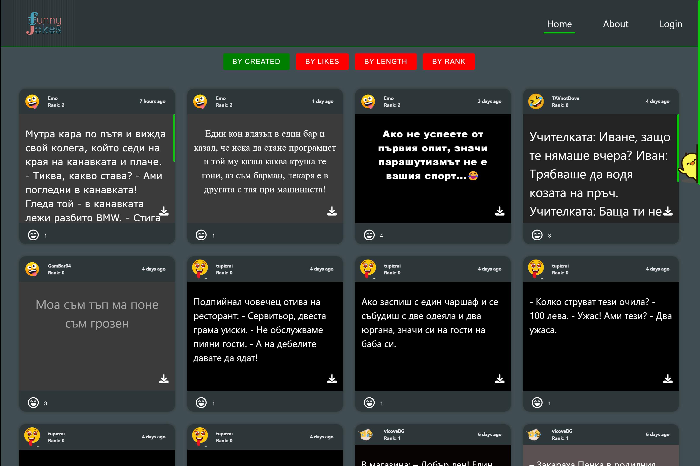

- [x] **About page**

On this page you can see more information about the site and out mission.

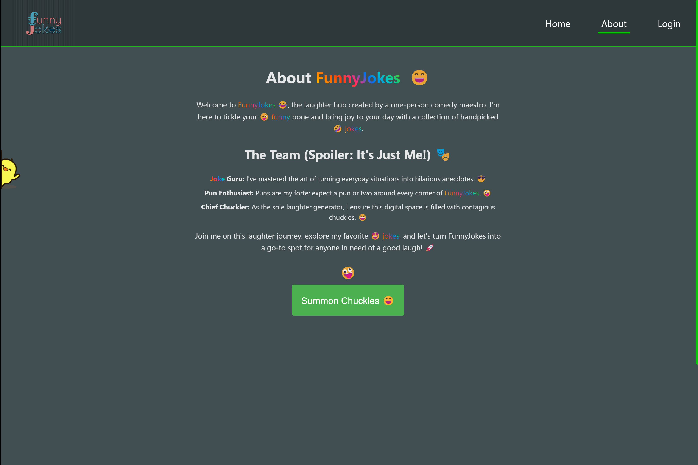

- [x] **Login/Register page**

On this page you can see login and register.

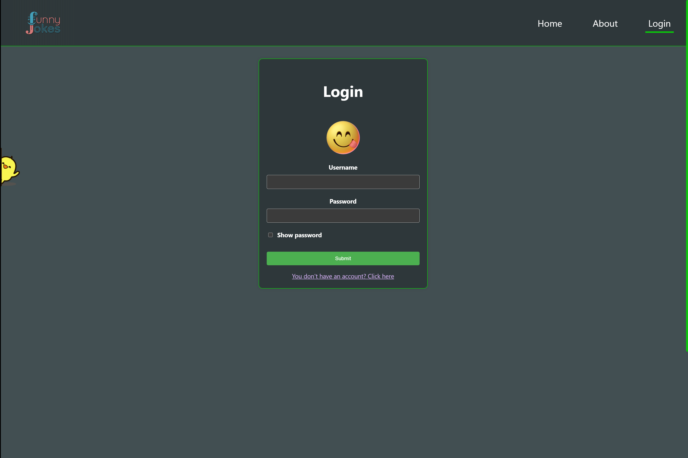

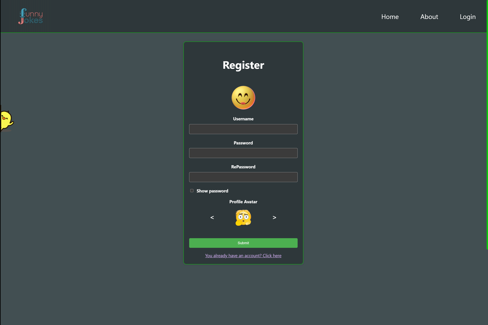

- [x] **Profile (user)**

On this page you can see your ```Profile account information```, ```Own Jokes```, ```Liked Jokes``` and also to ```Edit your profile```

```PROFILE``` here you can see your profile information!

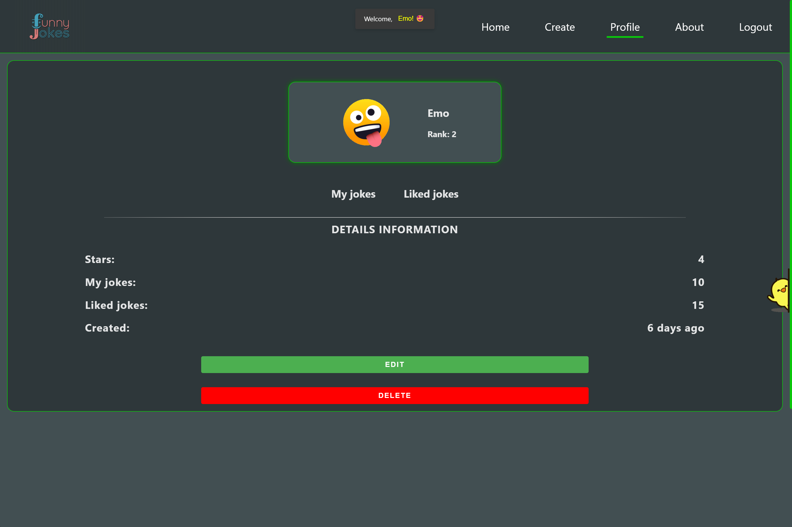

```OWN JOKES``` here you can see your list with own jokes!

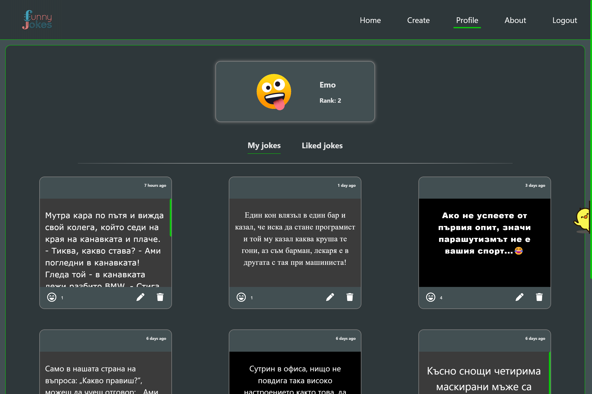

```LIKED JOKES``` here you can see your list with liked jokes!

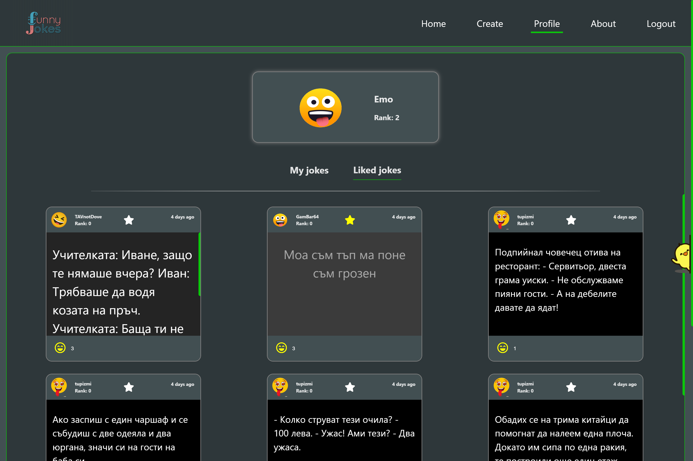

```PROFILE EDIT``` here you can edit your profile account information!

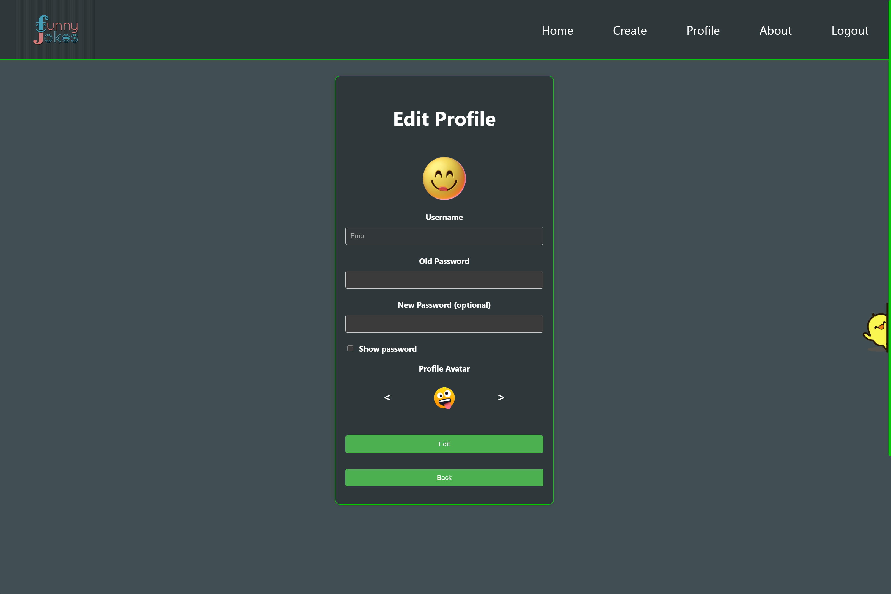

- [x] **Create joke page**

On this page you can create your own joke.

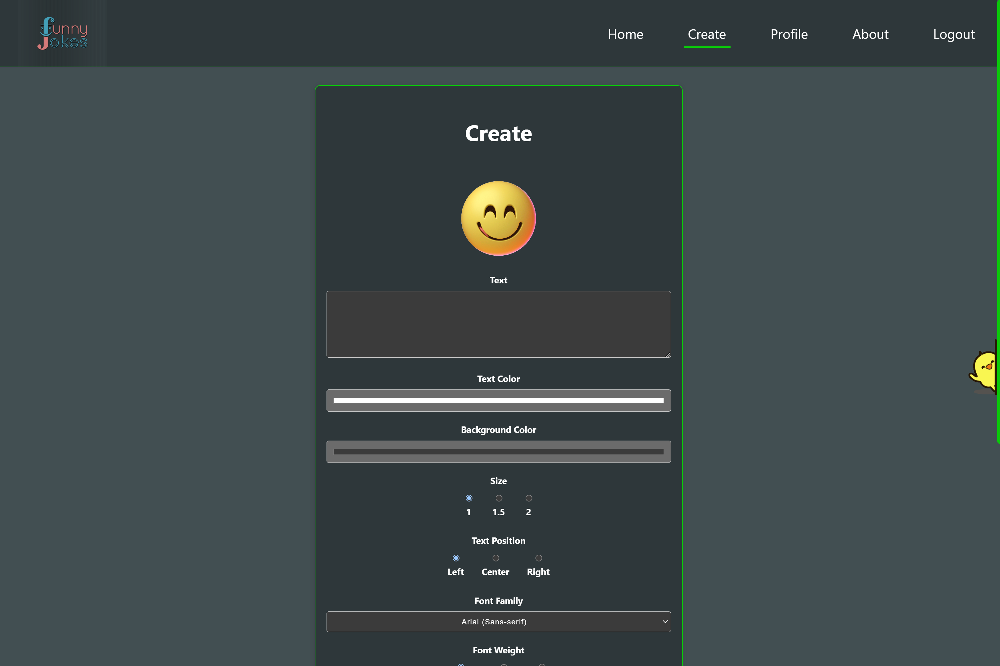
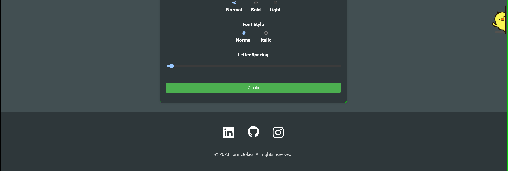

- [x] **Page not found**

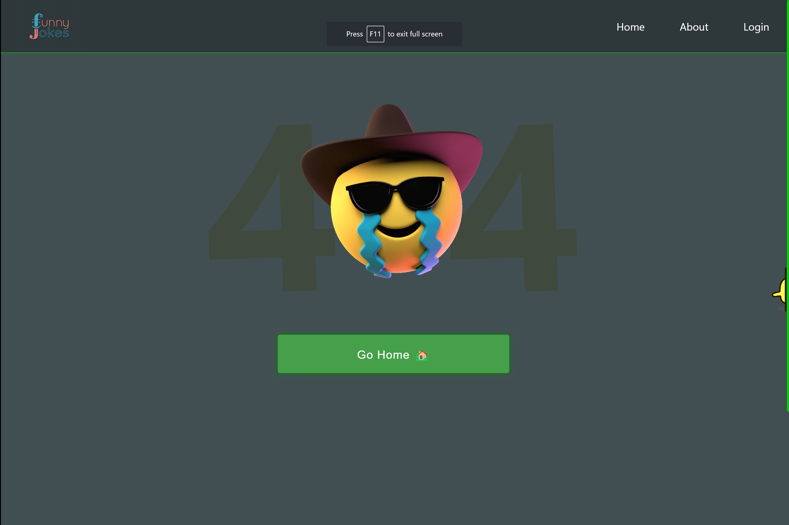

## END
